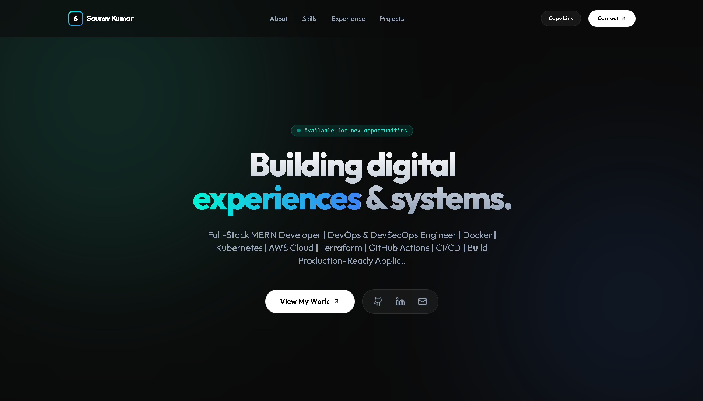
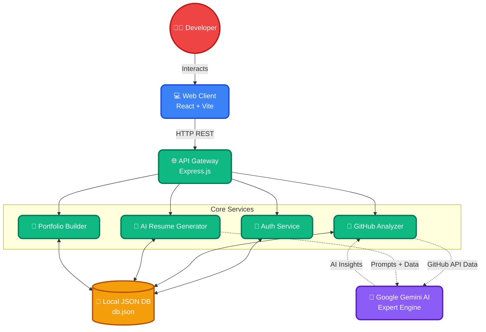

<div align="center">
  

  # 🚀 DevForge AI
  **Developer Career Intelligence Platform**

  [](https://reactjs.org/)
  [](https://www.typescriptlang.org/)
  [](https://nodejs.org/)
  [](https://expressjs.com/)
  [](https://vitejs.dev/)
  [](https://tailwindcss.com/)
  [](https://www.docker.com/)

  *A premium, production-level, full-stack SaaS platform designed to accelerate developer careers through AI.*
</div>

---

## ✨ Overview

DevForge AI deeply analyzes your GitHub repositories, coding frequency, DevOps footprint, and documentation quality. It dynamically generates ATS-optimized resumes, creates professional portfolio websites, calculates job description match scorecards, and prepares technical interview guides.

### 📸 Features Preview

| Portfolio Builder | AI Resume Builder | Repository Analytics |
| :---: | :---: | :---: |
|  |  |  |

---

## 🏗️ Architecture Flow

Here is the colorful high-level architecture diagram showing how the frontend, backend, database, and AI interact.



---

## 🛠️ Technology Stack

- **Frontend**: React + TypeScript, Vite, Tailwind CSS, Framer Motion, pure SVG animated visualizers (Doughnut dial, skills graph, heatmaps).
- **Backend**: Node.js + Express.js, fs-extra SQLite-like local persistence engine (`data/db.json`), axios integrations.
- **Docker Support**: Individual multi-stage Dockerfiles and dynamic orchestrator (`docker-compose.yml`).
- **AI Integrations**: Ready for Google Gemini API, with a robust local expert rule-based AI engine fallback guaranteeing 100% uptime.

---

## 📂 Codebase Architecture

```text
📦 DevForge AI
├── 📂 backend
│   ├── 📂 data
│   │   └── 📄 db.json               # Local JSON Database
│   ├── 📂 routes
│   │   ├── 📄 auth.js               # Auth & registration API
│   │   ├── 📄 analyze.js            # GitHub Intelligence & AI generation
│   │   ├── 📄 resumes.js            # Resume updates & Job comparator
│   │   └── 📄 portfolios.js         # Portfolios & Deploy logs simulator
│   ├── 📄 .env                      # API keys & ports
│   ├── 📄 db.js                     # Local database controllers
│   ├── 📄 server.js                 # Express server boots
│   └── 🐳 Dockerfile                # Backend container script
├── 📂 frontend
│   ├── 📂 src
│   │   ├── 📂 components
│   │   │   ├── 📄 LandingPage.tsx   # Premium dark-mode signup
│   │   │   ├── 📄 Dashboard.tsx     # SaaS command center
│   │   │   ├── 📄 ResumeEditor.tsx  # Interactive resume builder & PDF export
│   │   │   ├── 📄 LivePreview.tsx   # Browser portfolio simulator & Vercel builds
│   │   │   └── 📄 CustomChart.tsx   # Custom animated SVG graphs
│   │   ├── 📄 App.tsx               # Session gate controller
│   │   ├── 📄 api.ts                # Unified Axios REST client
│   │   ├── 📄 index.css             # Tailwind rules & glassmorphic custom layers
│   │   └── 📄 main.tsx              # React mounting root
│   ├── 📄 index.html                # Google Fonts & SEO tags
│   ├── 📄 tailwind.config.js        # Accent neon palettes
│   └── 🐳 Dockerfile                # Production Nginx multi-stage build script
├── 🐳 docker-compose.yml            # Container orchestration mapping
├── 📄 package.json                  # Monorepo concurrent scripts
└── 🚀 start-all.js                  # Cross-platform startup bootstrapper
```

---

## ⚡ Setup & Run

### Option A: Standard Local Run (Recommended)

1. **Install all dependencies**:
   ```bash
   npm run install-all
   ```
2. **Launch the ecosystem**:
   ```bash
   npm run dev
   ```
3. **Open the browser**:
   - Web Client: [http://localhost:5173](http://localhost:5173)
   - API Backend: [http://localhost:5000](http://localhost:5000)

### Option B: Docker Containers

To spin up both applications in isolated sandboxes:
```bash
docker-compose up --build
```
- Client App: [http://localhost:5173](http://localhost:5173)
- API Services: [http://localhost:5000](http://localhost:5000)

---

## 📡 REST API Reference

### 🔐 Authentication (`/api/auth`)
- `POST /login` - Dynamic login/registration; auto-creates user profiles upon first GitHub link.
- `GET /profile/:github` - Retrieves hydrated user stats.

### 🧠 GitHub Analysis (`/api/analyze`)
- `POST /` - GitHub Deep Intelligence Engine pulls public repository metadata and triggers Gemini/Mock AI to construct resumes and portfolios.

### 📄 AI Resumes (`/api/resumes`)
- `PUT /:id` - Saves customized resume content.
- `POST /:id/improve` - Suggests structural improvements and optimizes text blocks with AI.
- `POST /:id/match-job` - Pastes any target Job Description, returning match score metrics, missing tech list, and custom roadmap projects.

### 🌐 Portfolios (`/api/portfolios`)
- `PUT /:id` - Saves layout customization.
- `POST /:id/deploy` - Simulates a Vercel deploy, streaming live terminal build logs.
- `POST /:id/push-repo` - Simulates Git repository push operations.

<br/>
<div align="center">
  Built with ❤️ for Developers
</div>
