<div align="center">

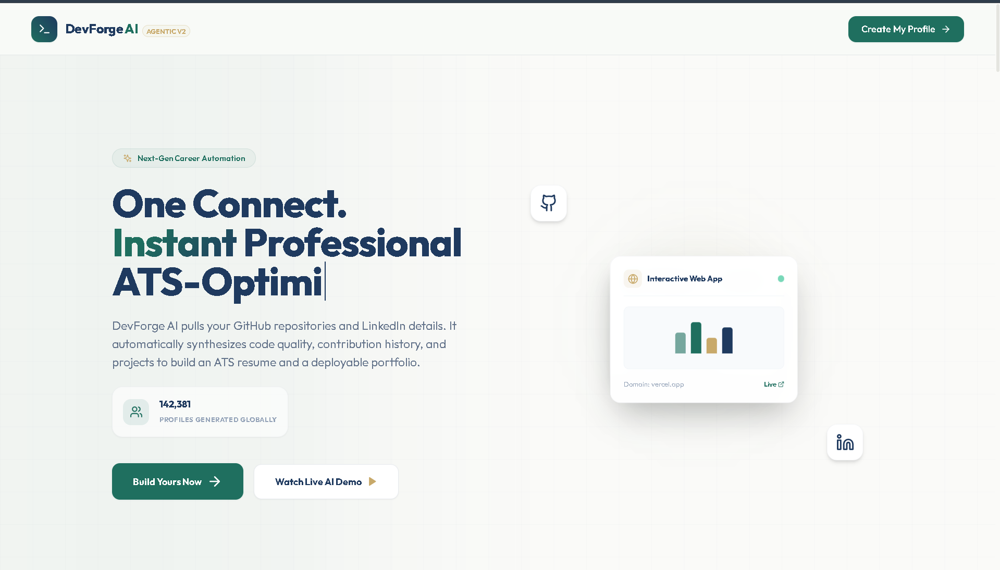

# 🚀 DevForge AI

### AI-Powered Developer Career Intelligence Platform

<p align="center">


</p>

---

### 💻 Built With

<p align="center">


</p>

---

### 🌟 Overview

**DevForge AI** is a modern **AI-powered Full Stack Developer Intelligence Platform**
that analyzes GitHub profiles, evaluates repositories, generates ATS-friendly resumes,
creates professional developer portfolios, provides repository insights, and helps developers
become job-ready through AI-driven recommendations.

Designed with a production-ready architecture using **React, TypeScript, Node.js, Express,
Docker, Tailwind CSS, and Google Gemini AI**, DevForge AI provides everything a developer
needs to build an impressive professional presence.

</div>

---

# ✨ Features

## 🤖 AI Powered

- 🧠 AI GitHub Repository Analysis
- 📄 AI Resume Builder
- 🌐 AI Portfolio Generator
- 🎯 ATS Resume Optimization
- 💼 Job Description Match Score
- 🛣 Personalized Career Roadmap
- 📈 AI Skill Analysis
- ⚡ Smart Recommendations

---

## 📊 Analytics

- GitHub Repository Insights
- Commit Activity
- Repository Health Score
- Code Quality Analysis
- Language Distribution
- Technology Detection
- Contribution Statistics
- Open Source Score

---

## 👨‍💻 Developer Tools

- Resume Editor
- Portfolio Builder
- Repository Explorer
- Career Dashboard
- Profile Management
- Skill Timeline
- Progress Tracking
- Deployment Simulator

---

## 🚀 Production Features

- Authentication System
- REST API
- Docker Support
- Responsive Design
- Dark Mode UI
- Modern Dashboard
- Modular Architecture
- AI Integration
- Local Database
- API Driven Design

---

# 📸 Application Preview

<div align="center">

## 🌍 Landing Page


Modern SaaS landing page with glassmorphism UI and responsive layout.

---

## 👨‍💻 Developer Dashboard

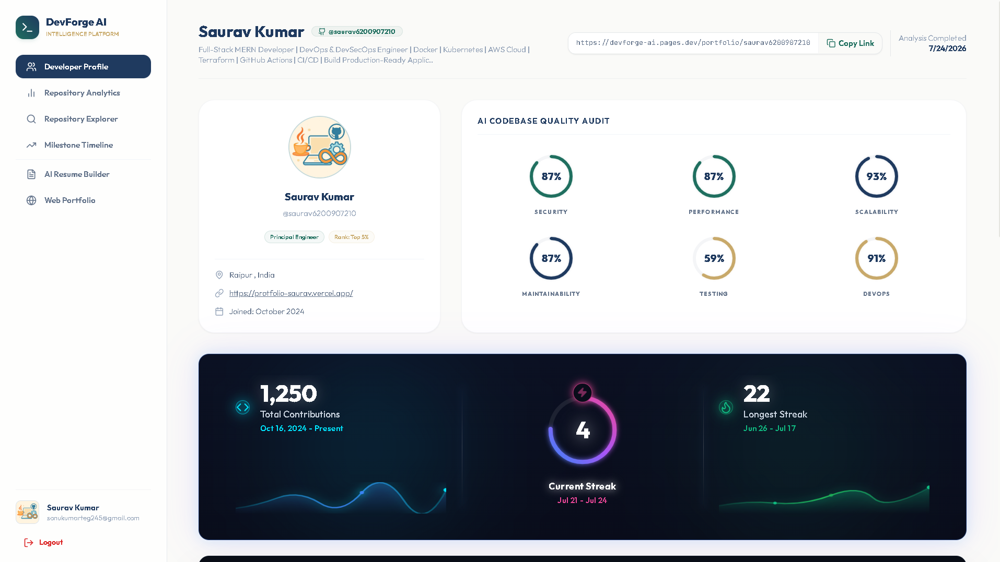

Personalized dashboard showing developer statistics, skills and AI insights.

---

## 📊 Advanced Analytics Dashboard

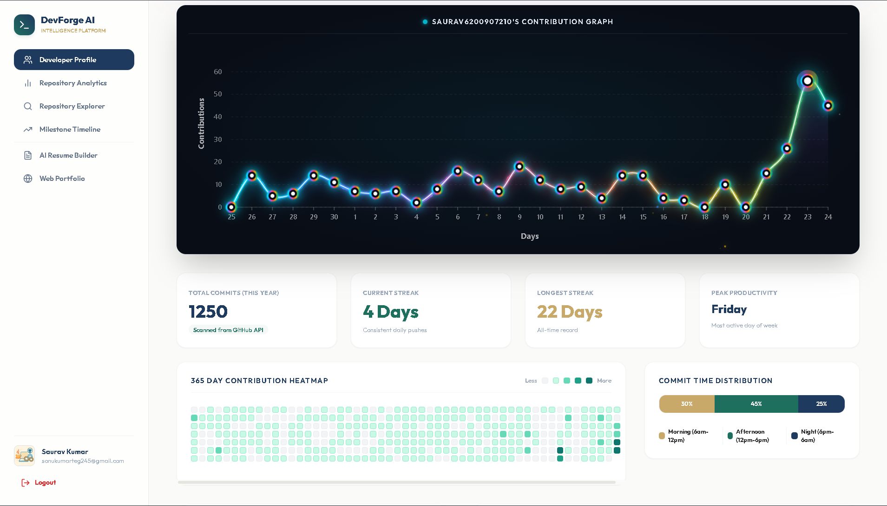

Detailed GitHub analytics, repository metrics and career intelligence.

---

## 📁 Repository Explorer

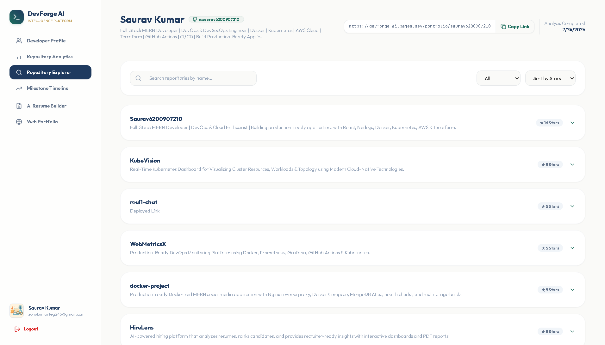

Explore repositories with technology stack, activity and health metrics.

---

## 📈 Repository Analytics

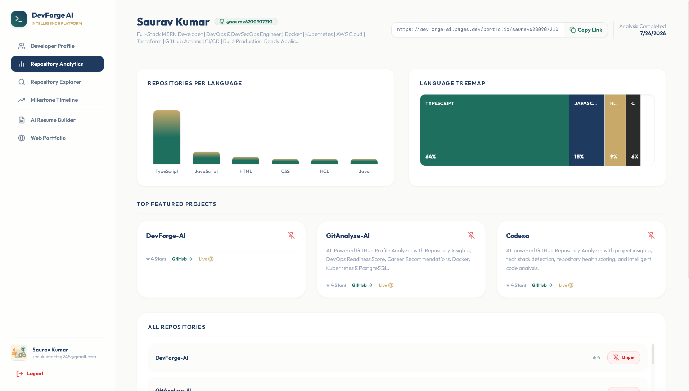

AI-powered repository analysis with performance indicators and recommendations.

---

## 📄 AI Resume Builder

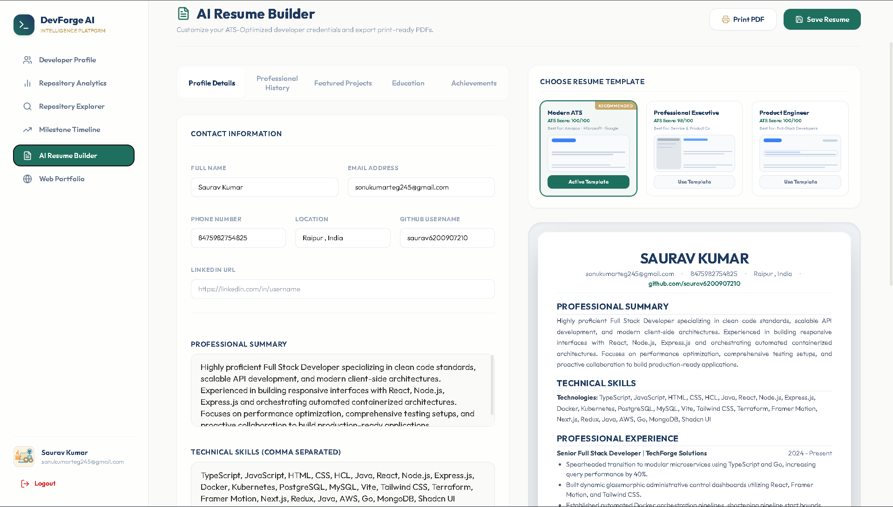

Automatically generate ATS-friendly professional resumes using AI.

---

## 🌐 Portfolio Builder


Generate beautiful developer portfolios in seconds.

---

## 🎯 Career Timeline

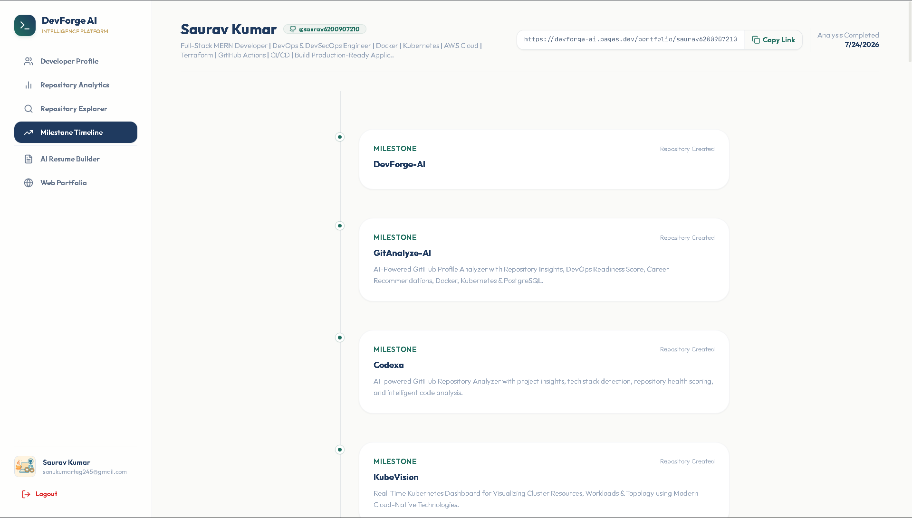

Visual roadmap helping developers reach their career goals.

</div>

---

# 🛠 Tech Stack

| Category | Technologies |
|-----------|--------------|
| Frontend | React, TypeScript, Vite, Tailwind CSS |
| Backend | Node.js, Express.js |
| AI | Google Gemini AI |
| Database | Local JSON Database |
| API | REST API |
| Styling | Tailwind CSS |
| Charts | SVG Components |
| Authentication | Express Authentication |
| Deployment | Docker, Docker Compose |
| Version Control | Git & GitHub |

---

# ⭐ Core Modules

| Module | Description |
|---------|-------------|
| 🔍 GitHub Analyzer | Analyze repositories, commits and technologies |
| 📄 Resume Builder | Generate ATS-friendly resumes |
| 🌐 Portfolio Builder | Create developer portfolios |
| 📈 Repository Analytics | AI-powered repository insights |
| 🎯 Job Match Engine | Match resume against job descriptions |
| 📊 Dashboard | Developer productivity dashboard |
| 🤖 AI Recommendation Engine | Personalized improvement suggestions |
| 🚀 Deployment Simulator | Simulated deployment logs |

---

# 🎯 Why DevForge AI?

✅ Modern UI

✅ AI Powered

✅ ATS Resume Generator

✅ Portfolio Builder

✅ GitHub Intelligence

✅ Career Analytics

✅ Developer Dashboard

✅ Production Ready Architecture

✅ Docker Support

✅ REST API

✅ Responsive Design

✅ Open Source

---

> **Empowering Developers with Artificial Intelligence 🚀**

---

# 🏗️ System Architecture

> DevForge AI follows a modern client-server architecture with AI-powered services.

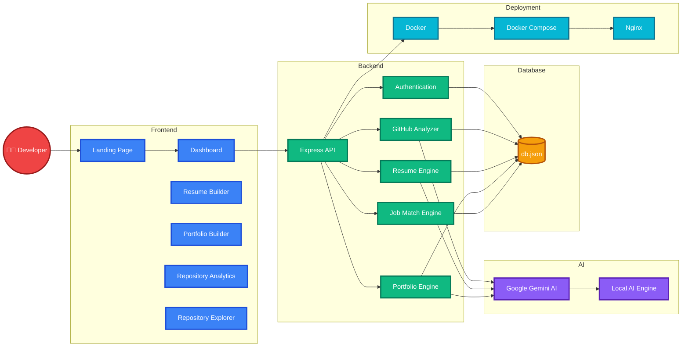

---

# 🌈 Complete Request Flow

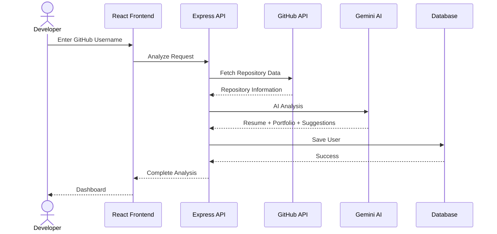

---

# 🚀 User Journey

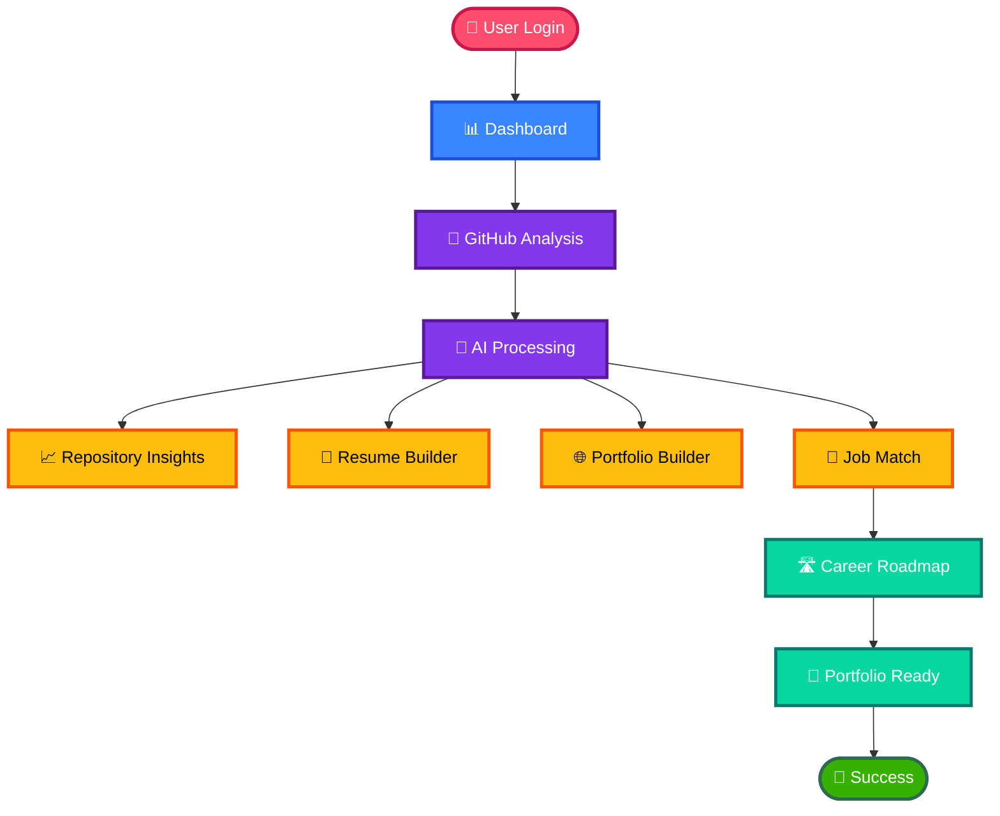

---

# 🤖 AI Processing Pipeline

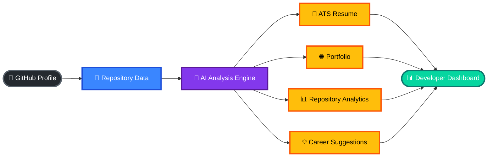

---

# ⚙️ Deployment Architecture

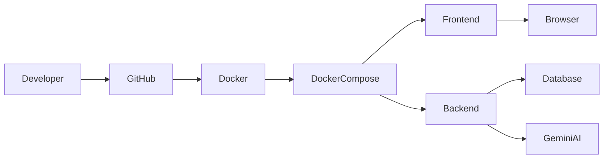

---

# 📂 Project Structure

```text
DevForge-AI
│
├── 📂 backend
│   │
│   ├── 📂 routes
│   │     ├── auth.js
│   │     ├── analyze.js
│   │     ├── resumes.js
│   │     └── portfolios.js
│   │
│   ├── 📂 data
│   │     └── db.json
│   │
│   ├── db.js
│   ├── server.js
│   ├── package.json
│   └── Dockerfile
│
├── 📂 frontend
│   │
│   ├── 📂 public
│   │     ├── landingpage.png
│   │     ├── developerprofile.png
│   │     ├── developerprofile2.png
│   │     ├── repositoryExplorer.png
│   │     ├── repositoryanalytic.png
│   │     ├── portfolio.png
│   │     ├── airesumerbuilder.png
│   │     └── milestonetimeline.png
│   │
│   ├── 📂 src
│   │     ├── components
│   │     ├── pages
│   │     ├── hooks
│   │     ├── services
│   │     ├── App.tsx
│   │     └── main.tsx
│   │
│   ├── package.json
│   └── Dockerfile
│
├── docker-compose.yml
├── package.json
├── README.md
└── LICENSE
```

---

# 🏛 ASCII Architecture

```text

                     ┌────────────────────────────┐
                     │      👨‍💻 Developer          │
                     └─────────────┬──────────────┘
                                   │
                                   ▼
               ┌──────────────────────────────────┐
               │        React + Vite Frontend     │
               │──────────────────────────────────│
               │ Landing Page                     │
               │ Dashboard                        │
               │ Resume Builder                   │
               │ Portfolio Builder                │
               │ Analytics                        │
               └──────────────┬───────────────────┘
                              │ REST API
                              ▼
              ┌──────────────────────────────────┐
              │         Express Backend          │
              │──────────────────────────────────│
              │ Authentication                  │
              │ GitHub Analyzer                 │
              │ Resume Engine                   │
              │ Portfolio Generator             │
              │ Job Match                       │
              └──────────────┬───────────────────┘
                             │
           ┌─────────────────┼─────────────────┐
           ▼                 ▼                 ▼
    ┌──────────────┐  ┌──────────────┐  ┌──────────────┐
    │ GitHub API   │  │ Gemini AI    │  │ Local DB     │
    └──────────────┘  └──────────────┘  └──────────────┘
                             │
                             ▼
                Resume • Portfolio • Analytics
```

---

# 📦 Component Interaction

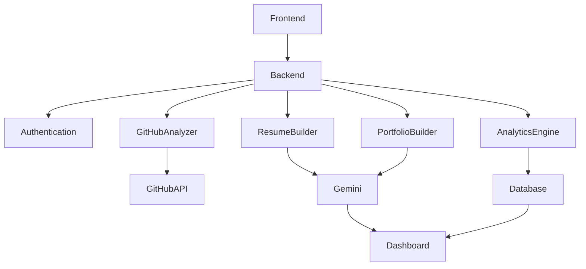

---

# 🔄 Data Flow

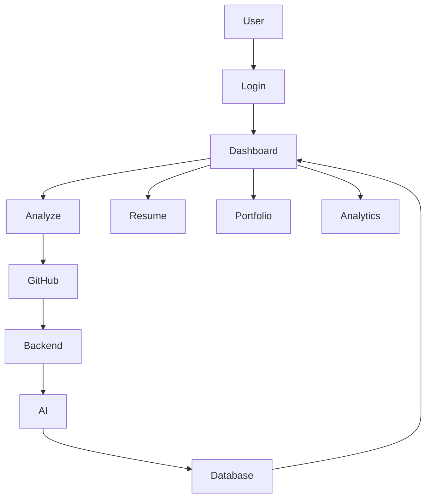

---

## 📌 Architecture Highlights

- ⚡ React + Vite Frontend
- 🚀 Express.js Backend
- 🤖 Google Gemini AI Integration
- 📊 GitHub Repository Intelligence
- 📄 ATS Resume Generator
- 🌐 Portfolio Generator
- 🎯 Job Match Engine
- 💾 Local JSON Database
- 🐳 Dockerized Deployment
- 📈 Production Ready Modular Architecture

---
---

# ⚡ Getting Started

Follow these steps to set up **DevForge AI** on your local machine.

---

# 📋 Prerequisites

Before running the project, ensure the following software is installed:

| Software | Version |
|----------|----------|
| Node.js | >=18.x |
| npm | >=9.x |
| Git | Latest |
| Docker | Latest (Optional) |
| Docker Compose | Latest (Optional) |
| VS Code | Recommended |

---

# 📥 Clone Repository

```bash
git clone https://github.com/Saurav6200907210/DevForge-AI.git

cd DevForge-AI
```

---

# 📦 Install Dependencies

Install root dependencies

```bash
npm install
```

Install frontend

```bash
cd frontend

npm install
```

Install backend

```bash
cd ../backend

npm install
```

Return to root

```bash
cd ..
```

---

# ▶️ Start Development

Run Frontend

```bash
cd frontend

npm run dev
```

Runs on

```
http://localhost:5173
```

---

Run Backend

```bash
cd backend

npm run dev
```

Runs on

```
http://localhost:5000
```

---

# 🚀 Run Everything Together

```bash
npm run dev
```

or

```bash
npm run start-all
```

---

# 🌍 Environment Variables

Create

```
backend/.env
```

Example

```env
PORT=5000

GEMINI_API_KEY=YOUR_GEMINI_API_KEY

JWT_SECRET=your_super_secret_key

DATABASE_PATH=data/db.json

NODE_ENV=development
```

---

# 📂 Folder Structure

```
backend
│
├── data
│     └── db.json
│
├── routes
│
├── server.js
│
├── db.js
│
└── .env
```

---

# 🐳 Docker Setup

Build Docker Images

```bash
docker compose build
```

Run Containers

```bash
docker compose up
```

Detached Mode

```bash
docker compose up -d
```

Stop Containers

```bash
docker compose down
```

Rebuild

```bash
docker compose up --build
```

Check Running Containers

```bash
docker ps
```

View Logs

```bash
docker compose logs
```

---

# 📡 REST API Documentation

## Authentication

### Register/Login

```
POST /api/auth/login
```

Example

```json
{
  "github":"Saurav6200907210"
}
```

---

### Get User

```
GET /api/auth/profile/:github
```

---

# GitHub Analysis

### Analyze Repository

```
POST /api/analyze
```

Body

```json
{
  "github":"Saurav6200907210"
}
```

Returns

- Repository Analysis
- AI Suggestions
- Skills
- Score
- Resume Data
- Portfolio Data

---

# Resume APIs

Get Resume

```
GET /api/resumes/:id
```

Update Resume

```
PUT /api/resumes/:id
```

Improve Resume

```
POST /api/resumes/:id/improve
```

Match Job Description

```
POST /api/resumes/:id/match-job
```

---

# Portfolio APIs

Get Portfolio

```
GET /api/portfolios/:id
```

Update Portfolio

```
PUT /api/portfolios/:id
```

Deploy Portfolio

```
POST /api/portfolios/:id/deploy
```

Push Repository

```
POST /api/portfolios/:id/push-repo
```

---

# 📦 API Response Example

```json
{
  "success": true,
  "score": 91,
  "repositories": 34,
  "skills": [
    "React",
    "Node.js",
    "Docker",
    "TypeScript"
  ],
  "recommendations": [
    "Improve README",
    "Increase Testing",
    "Add CI/CD"
  ]
}
```

---

# 📜 Available Scripts

Root

```bash
npm run dev
```

Starts frontend + backend

---

Frontend

```bash
npm run dev
```

Development Server

```bash
npm run build
```

Production Build

```bash
npm run preview
```

Preview Build

---

Backend

```bash
npm run dev
```

Development Mode

```bash
npm start
```

Production Mode

---

# ⚙️ Configuration

| Variable | Description |
|------------|-----------------------------|
| PORT | Backend Port |
| GEMINI_API_KEY | Google Gemini API |
| JWT_SECRET | Authentication Secret |
| DATABASE_PATH | JSON Database |
| NODE_ENV | Development/Production |

---

# ☁️ Deployment

## Frontend

- Cloudflare Pages
- Vercel
- Netlify

---

## Backend

- Render
- Railway
- Fly.io

---

## Container Deployment

```bash
docker compose up -d
```

---

# 🔐 Authentication Flow

```text
User

↓

Login

↓

GitHub Username

↓

Backend Validation

↓

User Created

↓

Session Started

↓

Dashboard
```

---

# 📊 API Workflow

```text
Frontend

↓

REST API

↓

GitHub API

↓

Gemini AI

↓

Repository Analysis

↓

Resume Generation

↓

Portfolio Generation

↓

Database

↓

Dashboard
```

---

# 💻 Local Development Workflow

```
Git Clone

↓

Install Dependencies

↓

Setup .env

↓

Run Backend

↓

Run Frontend

↓

Open Browser

↓

Analyze GitHub Profile

↓

Generate Resume

↓

Generate Portfolio
```

---

# 🧪 Testing

Run Backend

```bash
npm run dev
```

Test API

```
http://localhost:5000/api/auth/login
```

Open Frontend

```
http://localhost:5173
```

---

# 📈 Performance

✔ Fast React Rendering

✔ TypeScript Safety

✔ Docker Ready

✔ REST APIs

✔ Responsive Design

✔ AI Powered

✔ Modular Codebase

✔ Production Architecture

---
---

# 🌟 Feature Deep Dive

## 🤖 AI GitHub Analyzer

DevForge AI performs an in-depth analysis of public GitHub repositories to generate actionable career insights.

### Features

- Repository Intelligence
- Technology Detection
- Language Statistics
- Repository Health Score
- Commit Activity Analysis
- Open Source Contributions
- Documentation Analysis
- Project Quality Evaluation
- Career Recommendations

---

## 📄 AI Resume Builder

Automatically generates professional ATS-friendly resumes.

### Capabilities

- ATS Optimization
- AI Content Enhancement
- Resume Scoring
- Professional Templates
- PDF Export
- Experience Suggestions
- Skills Optimization
- Achievement Generator

---

## 🌐 Portfolio Builder

Generate beautiful developer portfolios without writing code.

### Includes

- Hero Section
- About
- Skills
- Experience
- Projects
- GitHub Integration
- Contact Section
- Responsive Design

---

## 🎯 Job Match Engine

Compare resumes with job descriptions.

Provides

- ATS Match Score
- Missing Skills
- Keyword Analysis
- Improvement Suggestions
- Learning Roadmap
- Resume Optimization

---

## 📊 Repository Analytics

Displays detailed statistics including

- Stars
- Forks
- Issues
- Pull Requests
- Languages
- Contributors
- Repository Age
- Activity Timeline

---

# 🚀 Project Roadmap

## ✅ Completed

- Authentication
- GitHub Analysis
- Resume Builder
- Portfolio Builder
- Repository Explorer
- Dashboard
- REST APIs
- Docker Support
- Responsive UI

---

## 🚧 In Progress

- AI Chat Assistant
- PDF Resume Templates
- Portfolio Themes
- Better Analytics
- Performance Improvements

---

## 🔮 Future Plans

- PostgreSQL Support
- Redis Cache
- Kubernetes Deployment
- GitHub OAuth
- CI/CD Integration
- AI Interview Simulator
- Cover Letter Generator
- Resume Versioning
- Multi-language Support
- Team Dashboard

---

# 🔒 Security

Current security practices include

- Environment Variables
- JWT Authentication
- Input Validation
- REST API Architecture
- Modular Backend
- Secure Configuration
- Docker Isolation

Future improvements

- OAuth
- Rate Limiting
- HTTPS
- Refresh Tokens
- RBAC
- Secret Manager

---

# 📈 Performance

Current optimizations

- React + Vite
- Lazy Components
- Modular Backend
- Optimized API Calls
- Responsive Layout
- SVG Visualizations
- Fast Local Database

---

# 📊 Technology Overview

| Layer | Technology |
|--------|------------|
| Frontend | React + TypeScript |
| Styling | Tailwind CSS |
| Backend | Express.js |
| Runtime | Node.js |
| AI | Google Gemini |
| Database | JSON Database |
| API | REST |
| Deployment | Docker |
| Version Control | Git |
| IDE | VS Code |

---

# 🤝 Contributing

Contributions are welcome.

## Fork Repository

```bash
git fork
```

Clone

```bash
git clone <repository-url>
```

Create Branch

```bash
git checkout -b feature/new-feature
```

Commit

```bash
git commit -m "Add new feature"
```

Push

```bash
git push origin feature/new-feature
```

Open Pull Request

---

# 📜 Coding Standards

- Clean Code
- Reusable Components
- Responsive Design
- Type Safety
- REST Standards
- Meaningful Commit Messages
- Documentation

---

# 🧪 Development Workflow

```text
Idea

↓

Planning

↓

Design

↓

Development

↓

Testing

↓

Review

↓

Deployment

↓

Maintenance
```

---

# 🐳 Docker Workflow

```text
Developer

↓

Source Code

↓

Docker Build

↓

Docker Image

↓

Docker Compose

↓

Frontend Container

↓

Backend Container

↓

Application Running
```

---

# 🌍 Deployment Options

| Platform | Status |
|-----------|---------|
| Docker | ✅ |
| Render | ✅ |
| Railway | ✅ |
| Vercel | ✅ |
| Netlify | ✅ |
| Cloudflare Pages | ✅ |

---

# 📚 Learning Outcomes

By exploring DevForge AI you can learn

- React
- TypeScript
- Node.js
- Express
- REST APIs
- Docker
- AI Integration
- GitHub APIs
- Authentication
- Dashboard Design
- Modern UI
- Full Stack Development

---

# 💡 Why DevForge AI?

✔ Modern UI

✔ AI Powered

✔ Full Stack Architecture

✔ ATS Resume Builder

✔ Portfolio Generator

✔ GitHub Intelligence

✔ Career Analytics

✔ Docker Ready

✔ Responsive

✔ Production Inspired

✔ Easy to Deploy

✔ Open Source

---

# 📄 License

Distributed under the **MIT License**.

Feel free to use, modify and contribute.

---

# 🙏 Acknowledgements

Special thanks to

- React Team
- Vite Team
- Node.js Community
- Express.js
- Tailwind CSS
- Docker
- Google Gemini AI
- GitHub API
- Open Source Community

---

# ⭐ Support

If you found this project useful

⭐ Star the repository

🍴 Fork the repository

🐛 Report issues

💡 Suggest new features

🤝 Contribute to the project

---

# 📬 Contact

**Developer:** Saurav Kumar

GitHub

```
https://github.com/Saurav6200907210
```

---

# 💖 Built For Developers

<div align="center">

## 🚀 DevForge AI

### Empowering Developers Through Artificial Intelligence


### ⭐ If you like this project, don't forget to Star the repository!

